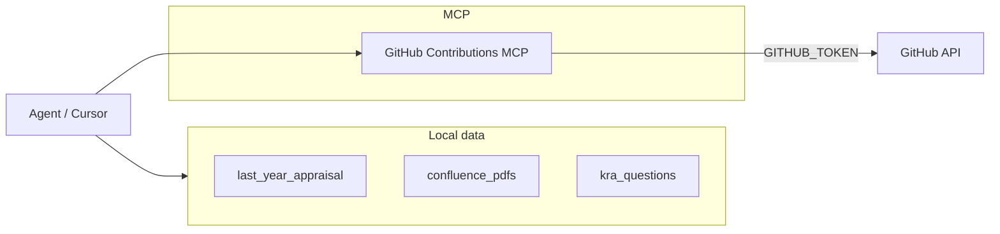

# Appraisal KRA Agent + Data Layout + GitHub MCP

## Goals

- **Project layout** so you can drop in last year's appraisal dump and Confluence PDFs for this year's work.
- **Agent** that answers KRA questions using that data plus your GitHub activity.
- **Official GitHub MCP** so the agent can pull your contributions and insert GitHub links into answers (per [Cursor install guide](https://github.com/github/github-mcp-server/blob/main/docs/installation-guides/install-cursor.md)).

## High-level architecture



- **Agent**: You run it in **Cursor** (chat + Composer) with this repo as the workspace. Cursor has access to the repo (including `data/`). You use the **official GitHub MCP server** (Streamable HTTP or Docker) so the model can call tools (e.g. list PRs, search issues) to get your contributions and links.
- **Data**: All under `data/`. The agent answers **only** the questions in `data/kra_questions.md`, using last year's appraisal, Confluence PDFs, and `data/github_contributions.md` (GitHub username and optional repo list) plus the GitHub MCP.
- **GitHub MCP**: [Official GitHub MCP Server](https://github.com/github/github-mcp-server) installed per [install-cursor.md](https://github.com/github/github-mcp-server/blob/main/docs/installation-guides/install-cursor.md). Agent uses its tools (e.g. list_pull_requests, search_issues) for the user/repos listed in `data/github_contributions.md` to paste links into KRA answers.

---

## 1. Project structure

```
appraisal-agent/
├── .cursor/
│   └── mcp.json                    # Project MCP config: official GitHub MCP (see install guide)
├── data/
│   ├── last_year_appraisal/        # Drop last year's appraisal here (PDF, docx, txt, or JSON)
│   │   └── .gitkeep
│   ├── confluence_pdfs/            # Confluence export PDFs for this year's work
│   │   └── .gitkeep
│   ├── kra_questions.md            # Required: the specific KRA questions you want answered (one per section/block)
│   └── github_contributions.md     # GitHub username and optional list of repo names you contributed to (for agent to pull PRs/issues)
├── prompts/
│   └── appraisal-kra.md           # Cursor prompt template (see "What is appraisal-kra.md?" below)
└── README.md
```

- **`data/last_year_appraisal/`**: Any format you have (PDF, Word, text). The agent (and optional PDF MCP) can read these; no code change needed when you add files.
- **`data/confluence_pdfs/`**: Place Confluence export PDFs here. Cursor can open PDFs; for better retrieval you can later add a PDF MCP (e.g. [PDF Reader MCP](https://cursormcp.dev/mcp-servers/805-pdf-reader-mcp)) and point it at this folder.
- **`data/kra_questions.md`**: **Required.** The exact KRA questions you need answers for (e.g. one numbered or bullet list). The agent will answer **only** these questions, using last year's appraisal, Confluence PDFs, and GitHub MCP to draft answers with links.
- **`data/github_contributions.md`**: **Required for GitHub data.** Your GitHub username and (optional) list of repository names (e.g. `org/repo`) you contributed to. The agent uses this with the official GitHub MCP to pull PRs/issues and add links. Example: username `AkhandAgarwal29`, then a list of repos if you want to restrict to specific ones.

**Quick setup:** Put last year's appraisal in `data/last_year_appraisal/`, Confluence PDFs in `data/confluence_pdfs/`, list your KRA questions in `data/kra_questions.md`, and set your GitHub username (and optional repos) in `data/github_contributions.md`.

---

## 2. Official GitHub MCP Server

Use the **[official GitHub MCP Server](https://github.com/github/github-mcp-server)**. Install in Cursor per the [install guide for Cursor](https://github.com/github/github-mcp-server/blob/main/docs/installation-guides/install-cursor.md).

**Options:**

- **Remote (recommended):** Streamable HTTP at `https://api.githubcopilot.com/mcp/`. Requires Cursor v0.48.0+. Configure in `.cursor/mcp.json` with `url` and `headers.Authorization: "Bearer YOUR_GITHUB_PAT"`.
- **Local:** Docker image `ghcr.io/github/github-mcp-server` with `GITHUB_PERSONAL_ACCESS_TOKEN` in env.

**Auth:** GitHub Personal Access Token (PAT). Create at [GitHub PAT settings](https://github.com/settings/personal-access-tokens/new). Use in Cursor MCP config (replace `YOUR_GITHUB_PAT` in the install guide).

**Agent usage:** The agent reads `data/github_contributions.md` for your username (e.g. `AkhandAgarwal29`) and optional repo list, then uses GitHub MCP tools (e.g. `list_pull_requests`, `search_issues`) to fetch your PRs/issues and paste GitHub links into KRA answers.

---

## 3. What is appraisal-kra.md?

**`prompts/appraisal-kra.md`** is a **Cursor prompt template**: a short instruction block you paste into Cursor Chat or Composer at the start of a session so the agent knows the task and constraints.

It contains:

- "You are helping me fill my annual appraisal. Answer **only** the questions listed in `data/kra_questions.md`."
- "Use evidence from: `data/last_year_appraisal/`, `data/confluence_pdfs/`, and the **GitHub MCP** (see `data/github_contributions.md` for my username/repos; call list_pull_requests, search_issues, etc. to get my PRs and contributions)."
- "Cite specific work and add GitHub links (e.g. PR URLs) where relevant."

So it's not code—it's the reusable "system" instructions that keep the agent focused on your KRAs and on using your data + GitHub links. You open it, copy the text, and paste it into Cursor when you start an appraisal session.

---

## 4. Cursor integration

- **Project-level MCP:** Add `.cursor/mcp.json` in the repo with the **official GitHub MCP** config (Streamable HTTP or Docker) from the [install guide](https://github.com/github/github-mcp-server/blob/main/docs/installation-guides/install-cursor.md). Replace `YOUR_GITHUB_PAT` with your GitHub Personal Access Token.
- **Usage:** Open this repo in Cursor, ensure GitHub MCP shows a green dot in Settings → MCP, (optionally) add a PDF MCP for `data/confluence_pdfs/`. Paste the contents of `prompts/appraisal-kra.md` into Chat/Composer, then ask the agent to answer the questions in `data/kra_questions.md` using last year's data, Confluence, and "my GitHub contributions and links" (agent reads `data/github_contributions.md` and uses GitHub MCP tools to paste links into the answer).

---

## 5. Optional: standalone CLI agent

If you want a **standalone** flow (e.g. "run one command, get a draft answer for KRA 1"):

- Add an `agent/` (or `scripts/`) module that:
  - Loads KRA questions from `data/kra_questions.md`,
  - Reads last-year and Confluence text (either from plain text or via a small PDF-text extraction, e.g. `pypdf`),
  - Calls the **same** GitHub MCP via MCP client (or duplicates the GitHub API calls in-process),
  - Sends a single prompt to an LLM (OpenAI / Anthropic) with that context and asks for a draft answer with links.
- This is optional; the primary flow is "Cursor + data folder + GitHub MCP."

---

## 6. Dependencies and env

- **Root:** No strict runtime deps; optional deps only if you add the standalone agent or PDF extraction.
- **GitHub MCP:** No local build. Use official server (remote or Docker). GitHub PAT required; set in `.cursor/mcp.json` per install guide.

---

## 7. Out of scope (for later)

- **Confluence MCP:** Not in initial scope; you can add a Confluence MCP later if you want live Confluence fetch instead of PDFs.

---

## Summary

| Deliverable | What you get |
|------------|----------------|
| **Project structure** | `data/last_year_appraisal/`, `data/confluence_pdfs/`, **required** `data/kra_questions.md`, **required** `data/github_contributions.md`, `.cursor/mcp.json`, `prompts/appraisal-kra.md` |
| **GitHub MCP** | Official [GitHub MCP Server](https://github.com/github/github-mcp-server) in Cursor per [install-cursor.md](https://github.com/github/github-mcp-server/blob/main/docs/installation-guides/install-cursor.md); agent uses `data/github_contributions.md` (username e.g. AkhandAgarwal29 + optional repos) and MCP tools to add PR/issue links |
| **Agent workflow** | Use Cursor; paste `prompts/appraisal-kra.md`; agent answers **only** questions in `data/kra_questions.md` using local data + `data/github_contributions.md` + GitHub MCP and adds links |

After implementation you'll: (1) fill `data/kra_questions.md` with your KRA questions, (2) set `data/github_contributions.md` (username AkhandAgarwal29 and optional repo list), (3) drop last year's appraisal and Confluence PDFs into `data/`, (4) configure GitHub MCP in `.cursor/mcp.json` with your PAT, (5) open the repo in Cursor, paste `prompts/appraisal-kra.md`, and ask the agent to answer the questions using your data and GitHub contributions with links.
