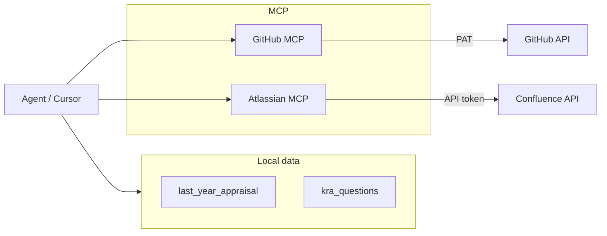

# Appraisal KRA Agent + Data Layout + GitHub MCP + Atlassian MCP

## Goals

- **Project layout** so you can drop in last year's appraisal dump; Confluence data is pulled live via **Atlassian MCP** (no PDFs).
- **Agent** that answers KRA questions using that data plus your GitHub activity.
- **Official GitHub MCP** so the agent can pull your contributions and insert GitHub links (per [Cursor install guide](https://github.com/github/github-mcp-server/blob/main/docs/installation-guides/install-cursor.md)).
- **Atlassian MCP** so the agent can pull Confluence pages, spaces, and search results for this year's work (no Confluence PDFs needed).

## High-level architecture


```mermaid
flowchart LR
  subgraph data [Local data]
    LastYear[last_year_appraisal]
    KRAs[kra_questions]
  end
  subgraph mcp [MCP]
    GitHubMCP[GitHub MCP]
    AtlassianMCP[Atlassian MCP]
  end
  Agent[Agent / Cursor]
  Agent --> data
  Agent --> GitHubMCP
  Agent --> AtlassianMCP
  GitHubMCP -->|PAT| API[GitHub API]
  AtlassianMCP -->|API token| Confluence[Confluence API]
```

- **Agent**: You run it in **Cursor** (chat + Composer) with this repo as the workspace. Cursor has access to the repo (including `data/`). You use the **GitHub MCP** and **Atlassian MCP** so the model can pull PRs/issues and Confluence content (pages, spaces, search) for evidence.
- **Data**: All under `data/`. The agent answers **only** the questions in `data/kra_questions.md`, using last year's appraisal, **Atlassian MCP** (Confluence pages/spaces/search), and `data/github_contributions.md` plus the GitHub MCP.
- **GitHub MCP**: [Official GitHub MCP Server](https://github.com/github/github-mcp-server). Agent uses its tools for the user/repos in `data/github_contributions.md` to add PR/issue links.
- **Atlassian MCP**: Confluence (and optionally Jira) MCP server. Agent uses tools such as `list-spaces`, `list-pages`, `get-page`, `conf_search` (CQL) to pull this year's work from Confluence—no PDFs required.

---

## 1. Project structure

```
appraisal-agent/
├── .cursor/
│   └── mcp.json                    # MCP config: GitHub MCP + Atlassian MCP (see install guides)
├── data/
│   ├── last_year_appraisal/        # Drop last year's appraisal here (PDF, docx, txt, or JSON)
│   │   └── .gitkeep
│   ├── kra_questions.md            # Required: the specific KRA questions you want answered (one per section/block)
│   ├── github_contributions.md     # GitHub username and optional repo list (for agent to pull PRs/issues)
│   └── atlassian_config.md         # Optional: Confluence space keys or page hints for the agent (see below)
├── prompts/
│   └── appraisal-kra.md            # Cursor prompt template (see "What is appraisal-kra.md?" below)
└── README.md
```

- **`data/last_year_appraisal/`**: Any format you have (PDF, Word, text). The agent (and optional PDF MCP) can read these; no code change needed when you add files.
- **`data/kra_questions.md`**: **Required.** The exact KRA questions you need answers for. The agent will answer **only** these using last year's appraisal, **Atlassian MCP** (Confluence), and GitHub MCP.
- **`data/github_contributions.md`**: **Required for GitHub data.** Your GitHub username and (optional) repo list. The agent uses GitHub MCP to pull PRs/issues and add links.
- **`data/atlassian_config.md`**: **Optional.** Confluence space keys, page IDs, or search hints so the agent knows which spaces/pages to pull via Atlassian MCP (e.g. "Space key: TEAM; focus on pages I authored this year").

**Quick setup:** Put last year's appraisal in `data/last_year_appraisal/`, list your KRA questions in `data/kra_questions.md`, set `data/github_contributions.md`, (optionally) add `data/atlassian_config.md`, and configure **GitHub MCP** and **Atlassian MCP** in `.cursor/mcp.json`. No Confluence PDFs needed—the agent pulls Confluence data live via Atlassian MCP.

---

## 2. Official GitHub MCP Server

Use the **[official GitHub MCP Server](https://github.com/github/github-mcp-server)**. Install in Cursor per the [install guide for Cursor](https://github.com/github/github-mcp-server/blob/main/docs/installation-guides/install-cursor.md).

**Options:**

- **Remote (recommended):** Streamable HTTP at `https://api.githubcopilot.com/mcp/`. Requires Cursor v0.48.0+. Configure in `.cursor/mcp.json` with `url` and `headers.Authorization: "Bearer YOUR_GITHUB_PAT"`.
- **Local:** Docker image `ghcr.io/github/github-mcp-server` with `GITHUB_PERSONAL_ACCESS_TOKEN` in env.

**Auth:** GitHub Personal Access Token (PAT). Create at [GitHub PAT settings](https://github.com/settings/personal-access-tokens/new). Use in Cursor MCP config (replace `YOUR_GITHUB_PAT` in the install guide).

**Agent usage:** The agent reads `data/github_contributions.md` for your username and optional repo list, then uses GitHub MCP tools to fetch your PRs/issues and paste GitHub links into KRA answers.

---

## 3. Atlassian MCP (Confluence)

Use an **Atlassian/Confluence MCP server** so the agent can pull Confluence content live (no PDFs). Options:

- **[MCP Server Atlassian Confluence](https://cursormcp.dev/mcp-servers/1155-mcp-server-atlassian-confluence)** (e.g. `@aashari/mcp-server-atlassian-confluence` via npx): tools like `list-spaces`, `list-pages`, `get-page`, `conf_search` (CQL). Configure `ATLASSIAN_SITE_NAME`, `ATLASSIAN_USER_EMAIL`, `ATLASSIAN_API_TOKEN` (e.g. in `~/.mcp/configs.json` or env).
- **[mcp-atlassian](https://github.com/sooperset/mcp-atlassian)** (Docker): Confluence + Jira; set `CONFLUENCE_URL`, `CONFLUENCE_USERNAME`, `CONFLUENCE_API_TOKEN` in env.

**Auth:** Create an [Atlassian API token](https://id.atlassian.com/manage-profile/security/api-tokens) and set your Confluence base URL (e.g. `https://your-company.atlassian.net/wiki`).

**Example `.cursor/mcp.json`** (add alongside GitHub MCP; npx Confluence-only example):

```json
"confluence": {
  "command": "npx",
  "args": ["-y", "@aashari/mcp-server-atlassian-confluence"]
}
```

Use env or `~/.mcp/configs.json` for `ATLASSIAN_SITE_NAME`, `ATLASSIAN_USER_EMAIL`, `ATLASSIAN_API_TOKEN`.

**Agent usage:** The agent uses Atlassian MCP tools to list spaces, list/get pages, and search Confluence (e.g. CQL) for this year's work. Optionally it reads `data/atlassian_config.md` for space keys or page hints.

---

## 4. What is appraisal-kra.md?

**`prompts/appraisal-kra.md`** is a **Cursor prompt template**: a short instruction block you paste into Cursor Chat or Composer at the start of a session so the agent knows the task and constraints.

It contains:

- "You are helping me fill my annual appraisal. Answer **only** the questions listed in `data/kra_questions.md`."
- "Use evidence from: `data/last_year_appraisal/`, the **Atlassian MCP** (Confluence: list-spaces, list-pages, get-page, conf_search), and the **GitHub MCP** (see `data/github_contributions.md`; use its tools for my PRs and contributions)."
- "Cite specific work and add GitHub/Confluence links where relevant."

So it's not code—it's the reusable "system" instructions that keep the agent focused on your KRAs and on using your data + Atlassian MCP + GitHub links. You open it, copy the text, and paste it into Cursor when you start an appraisal session.

---

## 5. Cursor integration

- **Project-level MCP:** Add `.cursor/mcp.json` with **GitHub MCP** and **Atlassian MCP** configs (see sections 2 and 3). Use your GitHub PAT and Atlassian API token/site credentials.
- **Usage:** Open this repo in Cursor, ensure both MCPs show a green dot in Settings → MCP. Paste the contents of `prompts/appraisal-kra.md` into Chat/Composer, then ask the agent to answer the questions in `data/kra_questions.md` using last year's data, **Confluence (via Atlassian MCP)**, and your GitHub contributions with links. No Confluence PDFs required.

---

## 6. Optional: standalone CLI agent

If you want a **standalone** flow (e.g. "run one command, get a draft answer for KRA 1"):

- Add an `agent/` (or `scripts/`) module that:
  - Loads KRA questions from `data/kra_questions.md`,
  - Reads last-year appraisal text (plain text or PDF extraction, e.g. `pypdf`),
  - Calls **Atlassian MCP** (or Confluence API) for Confluence content and **GitHub MCP** (or GitHub API) for contributions,
  - Sends a single prompt to an LLM with that context and asks for a draft answer with links.
- This is optional; the primary flow is "Cursor + data folder + GitHub MCP + Atlassian MCP."

---

## 7. Dependencies and env

- **Root:** No strict runtime deps; optional deps only if you add the standalone agent or PDF extraction for last year's appraisal.
- **GitHub MCP:** No local build; use official server (remote or Docker). GitHub PAT required in `.cursor/mcp.json`.
- **Atlassian MCP:** Use npx or Docker; Atlassian site name, user email, and API token required (env or `~/.mcp/configs.json`).

---

## Summary

| Deliverable | What you get |
|------------|----------------|
| **Project structure** | `data/last_year_appraisal/`, **required** `data/kra_questions.md`, **required** `data/github_contributions.md`, optional `data/atlassian_config.md`, `.cursor/mcp.json`, `prompts/appraisal-kra.md` (no Confluence PDFs) |
| **GitHub MCP** | Official [GitHub MCP Server](https://github.com/github/github-mcp-server); agent uses `data/github_contributions.md` and MCP tools to add PR/issue links |
| **Atlassian MCP** | Confluence (and optionally Jira) MCP; agent uses list-spaces, list-pages, get-page, conf_search to pull this year's work—no PDFs |
| **Agent workflow** | Use Cursor; paste `prompts/appraisal-kra.md`; agent answers **only** questions in `data/kra_questions.md` using last year's appraisal + Atlassian MCP (Confluence) + GitHub MCP and adds links |

After implementation you'll: (1) fill `data/kra_questions.md`, (2) set `data/github_contributions.md`, (3) optionally add `data/atlassian_config.md`, (4) drop last year's appraisal into `data/last_year_appraisal/`, (5) configure **GitHub MCP** and **Atlassian MCP** in `.cursor/mcp.json`, (6) open the repo in Cursor, paste `prompts/appraisal-kra.md`, and ask the agent to answer using your data, Confluence (via Atlassian MCP), and GitHub contributions with links.
